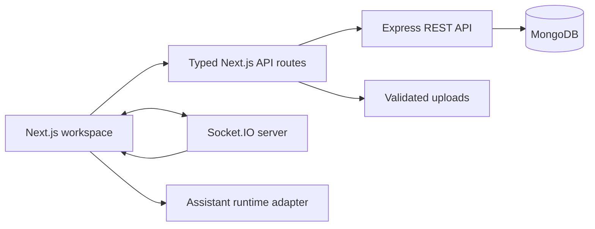

<h1 align="center">Chat Engine</h1>

<p align="center">
  A full-stack messaging workspace for direct conversations, group chat, file sharing, and real-time presence.
</p>

<p align="center">
  <a href="https://chatengine.ajiteshsrivastava.com/chat"><strong>Live demo</strong></a> ·
  <a href="https://ajiteshsrivastava.com">Portfolio</a> ·
  <a href="https://github.com/ajs1109/chat-engine">GitHub</a>
</p>

<p align="center">
  
  
  
  
  
  
</p>

---

Chat Engine is a portfolio-grade real-time communication product built around an existing Express and MongoDB backend. Its primary Next.js interface adds typed API boundaries, responsive conversation UX, rich messages, attachment handling, and a clean path for integrating an AI provider without coupling it to human chat.

## Highlights

| Area | Capability |
|---|---|
| Conversations | Direct messages, group creation, rename, membership management, and persistent history |
| Realtime | Socket.IO delivery, per-user rooms, chat rooms, and typing indicators |
| Messages | Grouped timelines, Markdown with GFM, copy/retry/soft-hide actions, and attachment-only messages |
| Files | Drag-and-drop uploads, image previews, document tiles, progress, validation, and error feedback |
| Identity | JWT authentication, bcrypt password hashing, protected chat membership, and user search |
| Interface | Responsive workspace, dark/light themes, notifications, settings, and accessible UI primitives |
| Assistant path | `assistant-ui` thread and streaming adapter ready for a real model/provider integration |
| Delivery | Multi-stage Docker image and GitHub Actions deployment to Azure App Service |

## Architecture



The repository intentionally contains two frontends:

- `web/` — the current Next.js App Router workspace and recommended interface.
- `client/` — the original Vite/React client retained as a migration reference.

The Express API remains the system of record for users, chats, messages, and Socket.IO events. The Next.js layer validates browser-facing requests and proxies them to the existing backend.

## Technology

- **Web:** Next.js 14, React 18, TypeScript, Tailwind CSS, Radix UI, assistant-ui
- **API:** Node.js, Express, Zod-backed typed boundaries
- **Realtime:** Socket.IO
- **Data:** MongoDB and Mongoose
- **Security:** JWT, bcrypt, protected resource membership
- **Delivery:** Docker, Azure Container Registry, Azure App Service, GitHub Actions

## Run locally

### Prerequisites

- Node.js 20+
- npm 10+
- A MongoDB connection string

### 1. Install the workspaces

```bash
git clone https://github.com/ajs1109/chat-engine.git
cd chat-engine
npm install
```

### 2. Configure the backend

Create `server/.env`:

```env
CONNECTION_URL=mongodb://127.0.0.1:27017/chat-engine
JWT_SECRET=replace-with-a-long-random-secret
CORS_ORIGIN=http://localhost:3000
PORT=5000
SERVE_NEXT=false
```

### 3. Configure the Next.js app

```bash
cp web/.env.example web/.env.local
```

The local defaults point the web app to `http://127.0.0.1:5000`. Update them if the API or Socket.IO server uses a different origin.

### 4. Start both services

```bash
# Terminal 1 — Express, MongoDB, and Socket.IO
npm --workspace server run dev

# Terminal 2 — Next.js workspace
npm run dev:web
```

Open [http://localhost:3000/chat](http://localhost:3000/chat).

## Useful commands

| Command | Purpose |
|---|---|
| `npm run dev:web` | Start the Next.js development server |
| `npm run build:web` | Create a production Next.js build |
| `npm run lint:web` | Run the web lint task |
| `npm --workspace web run typecheck` | Type-check the Next.js app |
| `npm --workspace server run dev` | Start the Express/Socket.IO backend with Nodemon |
| `npm run start:azure` | Run the combined production server used by the container |

## Repository map

```text
chat-engine/
├── web/                       # Current Next.js interface
│   ├── app/api/               # Typed proxy, upload, and assistant routes
│   ├── components/chat/       # Messaging workspace
│   └── lib/                   # API client, schemas, types, helpers
├── server/                    # Express, Mongoose, and Socket.IO backend
│   ├── controllers/
│   ├── models/
│   └── routes/
├── client/                    # Legacy Vite/React client
├── docs/                      # Current and target architecture notes
├── Dockerfile
└── package.json               # npm workspaces and deployment scripts
```

## Provider integration

The assistant interface currently uses a local adapter rather than a hosted model. To connect a provider, replace the implementation in `web/app/api/assistant/route.ts`, retain abort-signal handling, document the required environment variables, and keep provider messages behind the existing adapter boundary.

## Production notes

- Use strong, unique secrets and a production MongoDB deployment.
- Restrict `CORS_ORIGIN` to trusted HTTPS origins.
- Put durable uploads behind object storage; the included local upload path is suitable for development and single-instance demos.
- Review rate limits, content validation, observability, backups, and dependency advisories before operating a public multi-tenant instance.

## Author

Built by [Ajitesh Srivastava](https://ajiteshsrivastava.com) — [LinkedIn](https://www.linkedin.com/in/ajiteshsrivastava/) · [GitHub](https://github.com/ajs1109).

